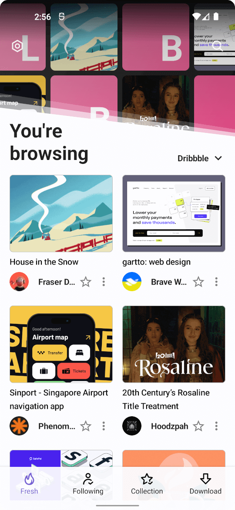

# Any

App for collecting news, articles, feeds and web pages. Currently, it's still in alpha, which means it's not stable and could change a lot in upcoming versions.

<a href="./images/screenshot_fresh_dribbble.png"></a>
<a href="./images/screenshot_fresh_filmgrab.png"></a>
<a href="./images/screenshot_post.png"></a>

# Features

- Customizable & configurable services, provides TypeScript API to create your own service
- Offline reading
- Builtin reader and webview
- Password protection
- Data export and import
- Post download
- Floating reading bubble
- Multiple post list layouts: List, card, full-width and grid
- Multiple theme color
- Dark mode
- Image filters

# Downloads

<a href="https://github.com/dokar3/any/releases">

</a>

# Build requirements

- Android Studio
- [Node.js](https://nodejs.org/) and [yarn](https://yarnpkg.com/) (check the [README](js/README.md) in the `js` folder for more details)

# Credits

This project is heavily inspired by the following projects:

- [tivi](https://github.com/chrisbanes/tivi) by Chris Banes
- [CatchUp](https://github.com/ZacSweers/CatchUp) by Zac Sweers
- [zipline](https://github.com/cashapp/zipline) by Cash App, formerly known as 'Duktape-Android'

# License

```
Copyright 2022 dokar3

Licensed under the Apache License, Version 2.0 (the "License");
you may not use this file except in compliance with the License.
You may obtain a copy of the License at

    http://www.apache.org/licenses/LICENSE-2.0

Unless required by applicable law or agreed to in writing, software
distributed under the License is distributed on an "AS IS" BASIS,
WITHOUT WARRANTIES OR CONDITIONS OF ANY KIND, either express or implied.
See the License for the specific language governing permissions and
limitations under the License.
```
